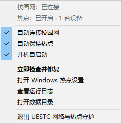

# UESTC Net Guardian

一个面向 Windows 的电子科技大学（UESTC）校园网与移动热点托盘守护程序。

它没有主窗口：登录 Windows 后常驻通知区域，在校园网掉线时自动重新认证，在移动热点意外关闭时按 Windows 中已有的配置重新开启。



## 功能

- 自动检查 UESTC Srun 在线状态，未认证时自动登录
- 使用当前门户的 `/cgi-bin/get_challenge` 与 `/cgi-bin/srun_portal` 协议
- 自动保持 Windows 移动热点开启
- 禁用 Windows 的“无客户端自动关闭热点”超时
- 沿用系统现有的热点名称、密码、频段和共享方式
- 托盘菜单分别控制校园网守护、热点守护和登录后自启动
- 支持立即检查、打开热点设置、查看日志和安全退出
- Windows 命名互斥锁保证只有一个实例运行
- 日志轮转及账号、密码、令牌和查询参数脱敏
- 可打包为有独立名称和图标的 `UESTCNetGuardian.exe`

## 系统要求

- Windows 10 2004 或更高版本 / Windows 11
- Python 3.13（从源码运行或构建时）
- UESTC 校园网环境（校园网自动认证功能）
- 支持 Windows 移动热点的无线网卡（热点守护功能）

热点守护调用 Windows Runtime 的 `NetworkOperatorTetheringManager`。如果设备或系统策略不支持移动热点，程序会记录错误，但不会影响校园网守护继续工作。

## 使用方式

### 方式一：直接下载 Release（推荐）

下载当前正式版 [UESTCNetGuardian-v1.0.0-windows-x64.zip](https://github.com/eliyahgan/UESTC-Net-Guardian/releases/download/v1.0.0/UESTCNetGuardian-v1.0.0-windows-x64.zip)，或前往[最新 Release 页面](https://github.com/eliyahgan/UESTC-Net-Guardian/releases/latest)选择更新版本，然后解压到任意目录。

压缩包已经包含 `UESTCNetGuardian.exe`、旁边必须保留的 `_internal` 目录、`.env.example`、`README.md` 和 `LICENSE`；不要把 EXE 单独移出压缩包。

1. 在 EXE 所在目录复制 `.env.example` 为 `.env`。
2. 填写校园网账号：

   ```env
   UESTC_USERNAME=你的学号或工号
   UESTC_PASSWORD=你的密码
   ```

3. 如果校方当前门户仍只提供 HTTP，并且你理解同一网络内的明文传输风险，再启用：

   ```env
   UESTC_ALLOW_INSECURE_HTTP=1
   ```

4. 运行 `UESTCNetGuardian.exe`，随后在托盘菜单中按需勾选“自动连接校园网”“自动保持热点”和“开机自启动”。

发布包未使用代码签名证书，Windows SmartScreen 可能会显示提示；请先确认下载地址和 Release 校验值，再决定是否运行。

> `.env` 包含明文凭据，已经被 `.gitignore` 排除。不要把它上传到 GitHub、聊天或网盘，也不要把校园网密码复用于其他重要账户。

### 方式二：让 Agent 辅助部署

把下面这一句话直接发给你信任的 Agent：

```text
请克隆 https://github.com/eliyahgan/UESTC-Net-Guardian，在 Windows PowerShell 中使用 Python 3.13 创建虚拟环境并安装 requirements-runtime.txt 和 requirements-build.txt，执行 powershell.exe -NoProfile -ExecutionPolicy Bypass -File .\build_guardian.ps1 编译 dist\UESTCNetGuardian\UESTCNetGuardian.exe，再引导我复制 .env.example 为 .env 填写校园网凭据、启动程序并在托盘中启用所需模式；不要读取、输出或提交 .env。
```

## 托盘菜单

| 菜单项 | 行为 |
| --- | --- |
| 自动连接校园网 | 定期检查 Srun 状态，未认证时自动登录 |
| 自动保持热点 | 禁用无客户端超时，并在热点关闭时重新开启 |
| 开机自启动 | 写入当前用户的 `HKCU\...\Run`，无需管理员权限 |
| 立即检查并修复 | 立即唤醒已启用的两个守护线程 |
| 打开 Windows 热点设置 | 打开系统移动热点设置页 |
| 查看运行日志 | 打开轮转日志 |
| 退出 | 停止守护线程并退出托盘程序；不会主动关闭热点 |

关闭“自动保持热点”只停止自动维护，不会关闭已经开启的热点。

## 工作方式

### 校园网守护

1. 调用 `/cgi-bin/rad_user_info` 判断当前是否已认证。
2. 未认证时重新发现门户与 AC ID。
3. 调用 `/cgi-bin/get_challenge` 获取短时 challenge。
4. 在本地生成 HMAC-MD5、XEncode 信息和 SHA-1 校验值。
5. 调用 `/cgi-bin/srun_portal` 登录，并再次复核在线状态。
6. 密码错误或账号锁定时暂停校园网守护，避免持续重试导致进一步锁定。

### 热点守护

1. 使用 Windows Runtime 获取当前上游网络配置。
2. 关闭系统的无客户端自动断开超时。
3. 读取移动热点状态和客户端数量。
4. 仅在热点为 `OFF` 时调用无参数 `StartTetheringAsync()`。
5. 无参数启动会沿用 Windows 已保存的热点配置；程序不会读取或修改热点密码。

## 构建 Windows EXE

安装运行与构建依赖：

```powershell
.\.venv\Scripts\python.exe -m pip install -r requirements-runtime.txt -r requirements-build.txt
```

构建：

```powershell
powershell.exe -NoProfile -ExecutionPolicy Bypass -File .\build_guardian.ps1
```

输出位置：

```text
dist\UESTCNetGuardian\UESTCNetGuardian.exe
```

项目使用 PyInstaller `onedir` 模式。分发时必须保留 `UESTCNetGuardian.exe` 旁边的 `_internal` 目录。

## 配置与数据

| 路径 | 内容 |
| --- | --- |
| `.env` | 校园网凭据和高级配置；绝不应提交 |
| `%LOCALAPPDATA%\UESTCNetGuardian\settings.json` | 两个守护模式的勾选状态 |
| `%LOCALAPPDATA%\UESTCNetGuardian\UESTCNetGuardian.log` | 脱敏后的轮转日志 |

完整环境变量示例见 [.env.example](.env.example)，本机部署细节见 [GUARDIAN_DEPLOYMENT.md](GUARDIAN_DEPLOYMENT.md)。

## 测试

```powershell
.\.venv\Scripts\python.exe -m unittest discover -s tests -v
```

测试覆盖 Srun 算法向量、JSON/JSONP 解析、在线状态、校园网后台循环、热点状态机、零参数热点启动、配置持久化及线程启停。

## 安全说明

- 项目不会在源码、EXE 或配置示例中嵌入账号和密码。
- `.env`、日志、虚拟环境、诊断结果和构建产物默认不进入 Git。
- 原始密码不会进入登录 URL；日志过滤账号、密码、challenge、info 和 checksum。
- 校方门户若仅支持 HTTP，网络上的凭据传输仍可能被窃听；这是上游门户限制，不是本程序能消除的风险。
- 热点守护不读取 SSID 或密码，只使用 Windows 已保存的配置启动热点。

发现安全问题时，请不要在公开 Issue 中粘贴 `.env`、日志原文或账号信息，参见 [SECURITY.md](SECURITY.md)。

## 来源与许可

本项目基于 [MuziIsabel/AutoConnectToInternetUESTC](https://github.com/MuziIsabel/AutoConnectToInternetUESTC) 修改，保留了原始 MIT 许可证及来源记录。现行实现已适配 UESTC Srun 门户，并增加 Windows 托盘、移动热点守护、配置持久化、单实例与安全加固。

项目采用 [MIT License](LICENSE)。来源版本与哈希见 [SOURCE_REVISION.txt](SOURCE_REVISION.txt)。
